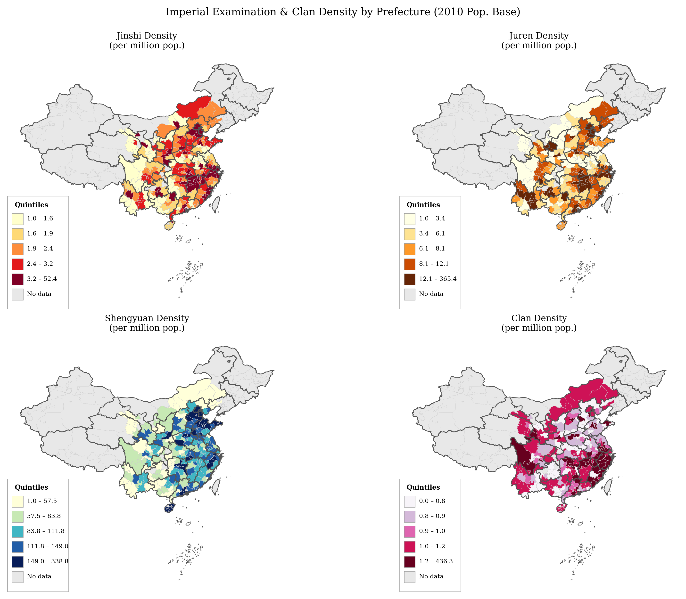
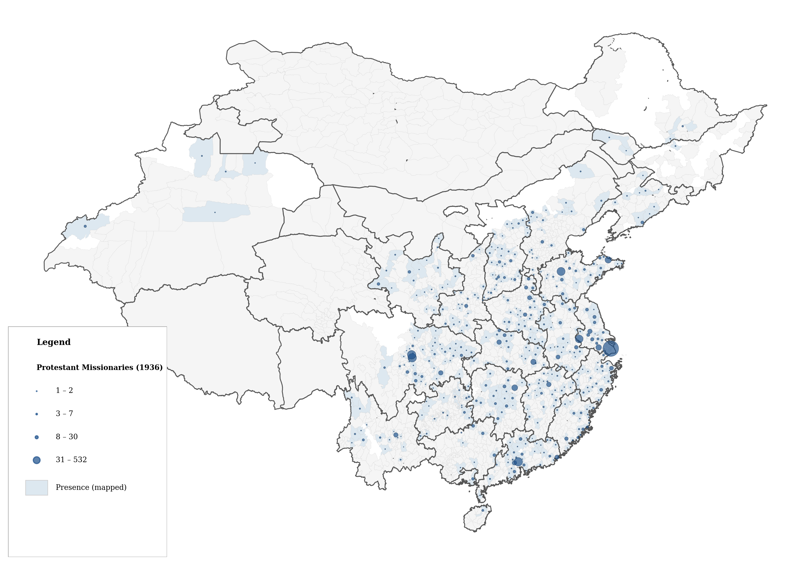
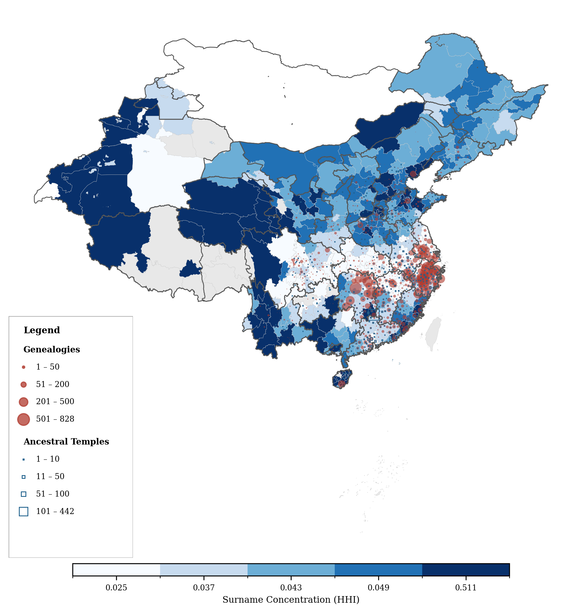

# Chinese Cultural Variables

Prefecture- and county-level datasets on historical Chinese cultural institutions and social structures, for use in empirical economics and social science research.

---

## Maps

### Imperial Examination & Clan Density by Prefecture
*Jinshi, Juren, Shengyuan, and Clan density (per million pop., 2010 base)*



### Protestant Missionary Presence, 1936



### Surname Concentration, Clan Genealogies & Ancestral Halls



---

## Repository Structure

```
Chinese_Cultural_Variables/
├── data/
│   ├── jinshi_density.xlsx           # Imperial exam degree-holder density by prefecture
│   ├── citang_ancestral_halls.xlsx   # Ancestral hall (祠堂) counts by county
│   ├── clan_genealogies.csv          # Clan genealogy (族谱) records by county
│   ├── protestant_missions_1936.xlsx # Protestant missionary presence, 1936
│   └── surname_distribution_2005.csv # Surname diversity indices by prefecture, 2005
└── maps/
    ├── map_keju_density.png          # Jinshi / Juren / Shengyuan / Clan density
    ├── map_protestant_1936.png       # Protestant missionary locations
    └── china_cultural_map.png        # Surname concentration + genealogies + ancestral halls
```

---

## Datasets

### 1. Imperial Examination Density — `data/jinshi_density.xlsx`

Prefecture-level (*地级市*) density of imperial civil examination (*keju*, 科举) degree-holders, normalised by 2010 population. Includes three degree tiers and clan strength:

| Variable | Description |
|----------|-------------|
| `jinshipop` | Jinshi (进士) per million pop. — highest degree, metropolitan exam |
| `jurenpop` | Juren (举人) per million pop. — provincial exam graduates |
| `shengyuanpop` | Shengyuan (生员) per million pop. — prefectural/county exam graduates |
| `clanpop` | Clan density per million pop. |
| `lnjinshipop` / `lnjurenpop` / `lnshengyuanpop` / `lnclanpop` | Log-transformed versions |
| `dialects` | Dialect group identifier |

**Sources**
- Chen, T., Kung, J. K. S., & Ma, C. (2020). Long live Keju! The persistent effects of China's civil examination system. *The Economic Journal*, 130(631), 2030–2064.
- 徐现祥、刘毓芸、肖泽凯（2015）。方言与经济增长。《经济学报》，第2期。

---

### 2. Ancestral Halls — `data/citang_ancestral_halls.xlsx`

County-level data on ancestral halls (祠堂, *cítáng*). Ancestral halls are the central physical and ritual institution of the Chinese lineage/clan (*zú*, 族), commonly used as a proxy for clan organisational strength.

---

### 3. Clan Genealogies — `data/clan_genealogies.csv`

County-level counts of extant clan genealogy records (族谱, *zúpǔ*). Unit of observation: county (县).

| Variable | Description |
|----------|-------------|
| `county_code` | County administrative code |
| `county_name` | County name |
| `clan_num` | Number of clan genealogy records |
| `prov` / `prov1` | Province identifiers |
| `startlng0`, `startlat0` | County centroid coordinates |

---

### 4. Protestant Missions, 1936 — `data/protestant_missions_1936.xlsx`

Individual-level records of Protestant missionaries active in China in 1936, with location and organisation information. Sheet 1 contains missionary-level entries; Sheet 2 aggregates counts by location.

---

### 5. Surname Distribution, 2005 — `data/surname_distribution_2005.csv`

Prefecture-level surname diversity data from 2005. Surname concentration (HHI) is used as a proxy for clan homogeneity and social cohesion. Unit of observation: prefecture (地级市).

| Variable | Description |
|----------|-------------|
| `dz_code` | Prefecture code |
| `prov_code`, `prov_name` | Province identifiers |
| `city_name` | Prefecture name |
| `n_persons` | Sample size |
| `n_surnames` | Number of distinct surnames |
| `hhi` | Herfindahl-Hirschman Index of surname concentration |
| `top1_surname` – `top5_surname` | Five most common surnames |
| `top1_share` – `top5_share` | Population share of each top surname |

---

## Notes

Administrative codes follow standard Chinese statistical conventions. Population base for density variables is the 2010 census.
